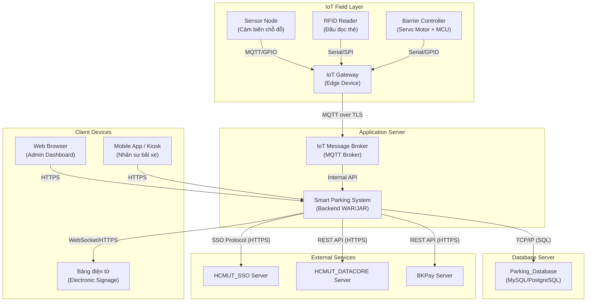
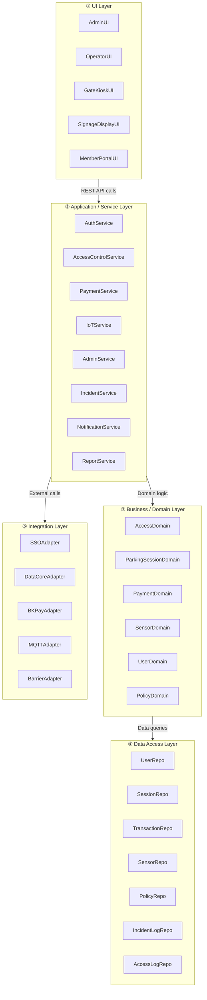
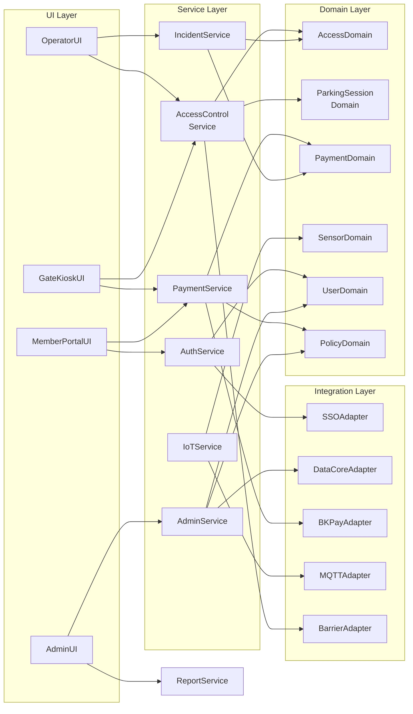

# Submission #3 — Thiết kế Kiến trúc Hệ thống Smart Parking System (IoT-SPMS)

---

## 1. Deployment View (Sơ đồ triển khai)

### 1.1 Tổng quan

Hệ thống được triển khai theo mô hình **multi-tier** gồm 4 tầng vật lý chính:

```
IoT Field Layer → Gateway Layer → Application Server Layer → Client Layer
```

### 1.2 Sơ đồ triển khai (Mermaid)



### 1.3 Thành phần chi tiết

#### 1.3.1 IoT Field Layer (Tầng hiện trường)

| Thành phần | Mô tả | Giao thức |
|---|---|---|
| **Sensor Node** | Cảm biến siêu âm/hồng ngoại tại mỗi chỗ đỗ, phát hiện trạng thái có xe/trống | GPIO → MCU |
| **RFID Reader** | Đầu đọc thẻ nhận diện tại barrier cổng vào/ra | SPI/Serial → MCU |
| **Barrier Controller** | MCU + servo motor điều khiển barrier, cảm biến chuyển động | GPIO/Serial |
| **Siren & Display** | Còi báo động + màn hình tại cổng hiển thị trạng thái | GPIO/I2C |
| **IoT Gateway** | Thiết bị edge (Raspberry Pi/ESP32 Gateway) tổng hợp dữ liệu từ sensor nodes và gửi lên server | MQTT over TLS |

> [!IMPORTANT]
> IoT Gateway đóng vai trò **edge computing** — có khả năng cache dữ liệu cục bộ khi mất kết nối server, và đồng bộ lại khi kết nối được khôi phục.

#### 1.3.2 Application Server (Tầng ứng dụng)

| Thành phần | Mô tả |
|---|---|
| **MQTT Broker** | Mosquitto/EMQX — nhận dữ liệu real-time từ IoT Gateways qua MQTT protocol |
| **Smart Parking Backend** | Ứng dụng chính (Java Spring Boot / FastAPI) xử lý toàn bộ business logic |
| **OS + Runtime** | Linux + JVM hoặc Python runtime |

Bên trong Backend chứa các component:
1. **AccessControlComponent** — xử lý logic ra/vào (mem_io, guest_io)
2. **PaymentComponent** — xử lý thanh toán (mem_pay, guest_pay)
3. **IoTManagementComponent** — xử lý dữ liệu cảm biến (iot)
4. **AdminComponent** — quản lý cấu hình, nhân sự, báo cáo (ad_pri)
5. **IncidentComponent** — xử lý sự cố đặc biệt (spec_occ 1-6)

Giao tiếp ra ngoài:
- **HCMUT_SSO** qua SSO Protocol (HTTPS)
- **HCMUT_DATACORE** qua REST API (HTTPS) — đồng bộ mỗi 24h
- **BKPay** qua REST API (HTTPS) — thanh toán
- **Database Server** qua TCP/IP (SQL)

#### 1.3.3 Database Server

| Thành phần | Mô tả |
|---|---|
| **Parking_Database** | Lưu trữ: thông tin người dùng, phiên gửi xe, log ra/vào, giao dịch, trạng thái sensor, cấu hình hệ thống |
| **DBMS** | MySQL hoặc PostgreSQL |
| **Giao tiếp** | TCP/IP với Application Server |

#### 1.3.4 Client Devices

| Thành phần | Mô tả | Giao thức |
|---|---|---|
| **Admin Dashboard** | Trình duyệt web trên PC — quản trị viên cấu hình, xem báo cáo | HTTPS |
| **Operator Kiosk/App** | Thiết bị tại bãi xe cho nhân sự — xử lý sự cố, mở barrier thủ công | HTTPS |
| **Electronic Signage** | Bảng LED hiển thị số chỗ trống, hướng dẫn | WebSocket/HTTPS |

#### 1.3.5 External Services

| Service | Chức năng | Giao thức |
|---|---|---|
| **HCMUT_SSO** | Xác thực thành viên trường (sinh viên, cán bộ, giảng viên) | SSO/OAuth (HTTPS) |
| **HCMUT_DATACORE** | Đồng bộ thông tin cá nhân và vai trò — chế độ chỉ đọc, mỗi 24h | REST API (HTTPS) |
| **BKPay** | Xử lý thanh toán gói gửi xe và phí gửi xe khách vãng lai | REST API (HTTPS) |

### 1.4 Luồng hoạt động tổng quát

1. **Cảm biến** gửi trạng thái chỗ đỗ mỗi 1s → **IoT Gateway**
2. **IoT Gateway** gom dữ liệu và publish qua **MQTT** → **MQTT Broker**
3. **Backend** subscribe MQTT topic, xử lý và cập nhật **Database**
4. **Backend** push cập nhật qua **WebSocket** → **Bảng điện tử** + **Admin Dashboard**
5. Khi thành viên quẹt thẻ RFID → **Gateway** gửi event → **Backend** xác thực qua **SSO** → mở **Barrier**
6. Khi khách nhấn nút → phát thẻ tạm → ghi log → hiển thị hướng dẫn
7. Thanh toán → **Backend** gọi **BKPay API** → nhận phản hồi → cập nhật trạng thái

---

## 2. Development/Implementation View

### 2.1 Component Diagram — Kiến trúc phân lớp

Hệ thống được tổ chức theo kiến trúc **Layered Architecture** (5 lớp):

#### Diagram tổng quan các layer



#### Diagram chi tiết quan hệ giữa các component



> [!NOTE]
> **Cách đọc diagram**: Mỗi mũi tên thể hiện quan hệ **"sử dụng/gọi đến"**. Ví dụ: `GateKioskUI → AccessControlService → AccessDomain → BarrierAdapter` là luồng xử lý khi người dùng quẹt thẻ tại cổng barrier.

### 2.2 Mô tả chi tiết từng Layer

#### Layer 1: User Interface Layer

| Component | Mô tả | Người dùng |
|---|---|---|
| **AdminUI** | Dashboard quản trị: cấu hình giá, phân quyền, xem báo cáo, quản lý nhân sự | Quản trị viên |
| **OperatorUI** | Giao diện nhân sự bãi xe: xử lý sự cố, mở barrier thủ công, tra cứu phiên | Nhân sự bãi xe |
| **GateKioskUI** | Màn hình tại cổng barrier: hiển thị trạng thái, hướng dẫn, QR thanh toán | Khách, Thành viên |
| **SignageDisplayUI** | Bảng điện tử: hiển thị số chỗ trống, hướng dẫn đến khu vực còn chỗ | Tất cả |
| **MemberPortalUI** | Web portal cho thành viên: quản lý gói gửi xe, xem lịch sử | Sinh viên, Cán bộ |

> Các UI component **không chứa logic nghiệp vụ**, chỉ gọi Service Layer qua REST API.

#### Layer 2: Application/Service Layer

| Component | Trách nhiệm | Use-cases liên quan |
|---|---|---|
| **AuthService** | Điều phối đăng nhập qua HCMUT_SSO, quản lý session, phân quyền RBAC | Xác thực |
| **AccessControlService** | Xử lý luồng ra/vào: đọc thẻ RFID, xác thực, điều khiển barrier, ghi log | mem_io, guest_io |
| **PaymentService** | Tính phí, tạo yêu cầu thanh toán BKPay, quản lý gói gửi xe | mem_pay, guest_pay |
| **IoTService** | Nhận dữ liệu sensor qua MQTT, tính toán chỗ trống, cập nhật signage | iot |
| **AdminService** | Cấu hình chính sách giá, quản lý nhân sự, đồng bộ DATACORE | ad_pri |
| **IncidentService** | Xử lý sự cố: khẩn cấp, lỗi thanh toán, quên thẻ, mất vé, thẻ quá hạn, mở barrier thủ công | spec_occ 1-6 |
| **NotificationService** | Gửi cảnh báo cho nhân sự (sensor lỗi, barrier timeout, sự cố) | Cross-cutting |
| **ReportService** | Tổng hợp báo cáo tài chính, thống kê lưu lượng xe | ad_pri |

#### Layer 3: Business/Domain Layer

| Component | Logic nghiệp vụ |
|---|---|
| **AccessDomain** | Quy tắc kiểm soát ra/vào: kiểm tra chuỗi vào/ra bất thường, xác thực thẻ hợp lệ, kiểm tra hạn sử dụng |
| **ParkingSessionDomain** | Quản lý phiên gửi xe: tạo/kết thúc phiên, tính thời gian gửi, gắn với thẻ/vé |
| **PaymentDomain** | Quy tắc tính phí: theo gói (tháng/kỳ/năm) cho thành viên, theo giờ cho khách, phí phạt mất thẻ |
| **SensorDomain** | Logic xử lý dữ liệu sensor: đánh dấu lỗi, loại bỏ sensor hỏng khỏi tính toán, tính tổng chỗ trống |
| **UserDomain** | Phân loại người dùng (Sinh viên, Cán bộ, Khách), quyền hạn theo vai trò |
| **PolicyDomain** | Chính sách giá, quy định phạt, cấu hình hệ thống có thể thay đổi bởi Admin |

#### Layer 4: Data Access Layer

| Repository | Dữ liệu quản lý |
|---|---|
| **UserRepository** | Thông tin người dùng đồng bộ từ DATACORE |
| **ParkingSessionRepository** | Phiên gửi xe (thời gian vào/ra, thẻ ID, cổng) |
| **TransactionRepository** | Giao dịch thanh toán (BKPay, tiền mặt) |
| **SensorRepository** | Trạng thái sensor, sơ đồ bãi đỗ |
| **PolicyRepository** | Bảng giá, chính sách ưu đãi, cấu hình hệ thống |
| **IncidentLogRepository** | Log sự cố đặc biệt |
| **AccessLogRepository** | Log ra/vào cổng (timestamp, userID, gateID) |

#### Layer 5: Integration Layer

| Adapter | Hệ thống ngoài | Vai trò |
|---|---|---|
| **SSOAdapter** | HCMUT_SSO | Xác thực đăng nhập, nhận token |
| **DataCoreAdapter** | HCMUT_DATACORE | Đồng bộ dữ liệu nhân sự/sinh viên (read-only, mỗi 24h) |
| **BKPayAdapter** | BKPay | Tạo yêu cầu thanh toán, nhận phản hồi giao dịch, tạo QR code |
| **MQTTAdapter** | IoT Gateway (MQTT Broker) | Subscribe topic sensor data, publish lệnh điều khiển barrier |
| **BarrierAdapter** | Barrier Controller | Gửi lệnh mở/đóng barrier qua IoT Gateway |

### 2.3 Implementation Frameworks đề xuất

| Thành phần | Công nghệ |
|---|---|
| Backend | Java Spring Boot hoặc Python FastAPI |
| Frontend (Admin/Operator) | React hoặc HTML-CSS-JavaScript |
| Gate Kiosk / Signage | HTML-CSS-JS (chạy trên trình duyệt nhúng) |
| IoT Gateway | Python / C++ trên Raspberry Pi hoặc ESP32 |
| MQTT Broker | Mosquitto hoặc EMQX |
| Database | MySQL hoặc PostgreSQL |
| Real-time Communication | WebSocket (cho signage + dashboard) |

---

## 3. Giải thích Kiến trúc

### 3.1 Tại sao kiến trúc này phù hợp?

**a) Layered Architecture** phù hợp với yêu cầu đề bài:
- Tách biệt rõ ràng giữa UI, logic nghiệp vụ và truy cập dữ liệu
- Dễ phân công (mỗi thành viên nhóm phụ trách 1 layer/component)
- Dễ bảo trì và mở rộng từng phần độc lập

**b) IoT Gateway + MQTT** phù hợp với hệ thống parking thực tế:
- MQTT là giao thức nhẹ, phù hợp thiết bị IoT tài nguyên hạn chế
- Gateway đóng vai trò edge computing, giảm tải cho server
- Mô hình publish/subscribe cho phép nhiều sensor gửi dữ liệu đồng thời

**c) Integration Layer với Adapter Pattern** đảm bảo:
- Hệ thống không phụ thuộc trực tiếp vào API bên ngoài (SSO, DATACORE, BKPay)
- Dễ thay thế hoặc mock khi phát triển MVP

### 3.2 Xử lý dữ liệu Real-time

```
Sensor (1s/lần) → IoT Gateway (gom batch) → MQTT Broker → IoTService → Database
                                                                ↓
                                              WebSocket push → Signage + Dashboard
```

- **Sensor** gửi trạng thái mỗi 1 giây theo yêu cầu use-case `iot`
- **IoT Gateway** gom dữ liệu từ nhiều sensor, giảm số lượng message lên server
- **IoTService** xử lý, tính toán tổng chỗ trống, cập nhật database
- **WebSocket** push cập nhật real-time đến bảng điện tử và dashboard quản trị
- Đảm bảo NFR: trạng thái chỗ trống trên bảng điện tử khớp >98% với thực tế

### 3.3 Xử lý High Concurrency (nhiều user đồng thời)

| Vấn đề | Giải pháp |
|---|---|
| Nhiều xe vào/ra cùng lúc | Mỗi cổng barrier hoạt động độc lập qua IoT Gateway riêng, xử lý song song |
| Nhiều sensor gửi dữ liệu cùng lúc | MQTT Broker xử lý hàng nghìn kết nối đồng thời, IoTService batch processing |
| Nhiều admin/nhân sự truy cập | Backend stateless, hỗ trợ horizontal scaling nếu cần |
| Barrier mở trong ≤2 giây | Xác thực cached locally tại Gateway, chỉ cần round-trip khi cache miss |
| Thanh toán đồng thời | Transaction isolation tại database, idempotent payment request |

### 3.4 Xử lý Lỗi hệ thống (Fault Tolerance)

#### a) Sensor hỏng
- **SensorDomain** đánh dấu sensor lỗi là "Bảo trì/Không xác định" (theo use-case `iot`)
- Loại sensor đó khỏi tính toán chỗ trống
- **NotificationService** gửi cảnh báo cho Admin
- Nhân sự bãi xe cập nhật trạng thái thủ công qua **OperatorUI**

#### b) Mất kết nối IoT Gateway ↔ Server
- Gateway lưu dữ liệu **offline** vào bộ nhớ cục bộ
- Khi kết nối khôi phục → đồng bộ lại (MQTT QoS 1 hoặc 2 đảm bảo delivery)
- Dashboard hiển thị "Mất kết nối IoT", giữ trạng thái cuối cùng nhận được

#### c) Mất kết nối HCMUT_SSO / HCMUT_DATACORE
- Hệ thống chuyển sang **chế độ offline** sử dụng dữ liệu local đã cache
- AccessControlService cho phép xác thực dựa trên bản sao dữ liệu (đồng bộ mỗi 24h)
- Chuyển sang chế độ Manual (use-case `spec_occ`)

#### d) Mất kết nối BKPay
- Hệ thống thông báo lỗi, hướng dẫn thanh toán tiền mặt
- Nhân sự bãi xe ghi nhận thủ công, đồng bộ khi BKPay khôi phục

#### e) Barrier lỗi
- Nếu có vật cản khi đóng → barrier giữ mở, cảnh báo sau 15s
- Nếu hệ thống điều khiển không phản hồi → mở bằng nút nhấn vật lý hoặc khóa cơ

---

## 4. Mapping Use-cases → Components

| Use-case | Service | Domain | Repository | Integration |
|---|---|---|---|---|
| mem_io | AccessControlService | AccessDomain, UserDomain | AccessLogRepository, UserRepo | SSOAdapter, BarrierAdapter |
| guest_io | AccessControlService | AccessDomain, ParkingSessionDomain | AccessLogRepository, SessionRepo | BarrierAdapter |
| mem_pay | PaymentService | PaymentDomain, PolicyDomain | TransactionRepo, PolicyRepo | BKPayAdapter |
| guest_pay | PaymentService | PaymentDomain | TransactionRepo, SessionRepo | BKPayAdapter |
| ad_pri | AdminService | PolicyDomain, UserDomain | PolicyRepo, UserRepo | DataCoreAdapter |
| iot | IoTService | SensorDomain | SensorRepo | MQTTAdapter |
| spec_occ 1-6 | IncidentService | AccessDomain, PaymentDomain | IncidentLogRepo | BarrierAdapter, BKPayAdapter |

---

## 5. Những phần cần hoàn thiện cho Submission #3

> [!IMPORTANT]
> Theo yêu cầu đề bài, Submission #3 cần: **Deployment View**, **Development View**, **Class Diagram**, **Method Descriptions**, và **Test Cases (bonus)**.

### Checklist

- [x] Deployment View — đã thiết kế ở mục 1
- [x] Development/Implementation View — đã thiết kế ở mục 2
- [ ] **Class Diagram** — cần vẽ diagram chính thức với các entity class, business class, và view/controller class (xem outline bên dưới)
- [ ] **Method Descriptions** — mô tả chi tiết từng method trong class diagram
- [ ] **Test Cases** (bonus) — viết test case cho các luồng chính

### 5.1 Class Diagram Outline (cần vẽ chính thức)

**Entity Classes:**
- `User` (id, name, role, cardID, status)
- `Student` extends User (studentID, subscription)
- `Staff` extends User (staffID, department)
- `Guest` (tempTicketID, vehicleInfo, entryTime)
- `ParkingSession` (sessionID, userID, entryTime, exitTime, gateID, status)
- `Transaction` (transactionID, sessionID, amount, method, status, timestamp)
- `Subscription` (subID, userID, planType, startDate, endDate, status)
- `ParkingSlot` (slotID, zoneID, sensorID, status)
- `Sensor` (sensorID, type, status, lastReading, lastUpdated)
- `Gate` (gateID, location, barrierStatus, type)
- `Policy` (policyID, userRole, vehicleType, pricePerUnit, fineAmount)
- `IncidentLog` (logID, type, timestamp, operatorID, description, resolution)

**Controller/Service Classes:**
- `AccessController` — handleEntry(), handleExit(), validateCard()
- `PaymentController` — calculateFee(), createPaymentRequest(), processPayment()
- `IoTController` — processSensorData(), updateSlotStatus(), getAvailability()
- `AdminController` — updatePolicy(), syncDataCore(), manageStaff()
- `IncidentController` — activateEmergency(), resolvePaymentError(), handleLostCard()
- `BarrierController` — openBarrier(), closeBarrier(), manualOverride()
- `AuthController` — login(), logout(), validateToken()

---

*Tài liệu này được xây dựng dựa trên phân tích toàn bộ: Project Description, Submission #1 (Requirements & Use-cases), Submission #2 (Sequence & Activity Diagrams), và Sample Report từ kỳ trước.*
